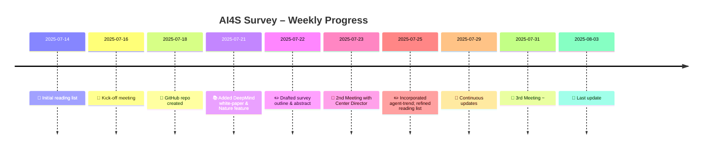

 # AI for Science (AI4S) – Reading List & Survey Outline

**Last updated**: **05 Aug 2025**

> Curated resources and draft outline for an upcoming **Survey** paper on the landscape of *Artificial Intelligence for Science*. All references below are hyper‑linked for quick access.

---

## Table of Contents

1. [Survey Outline](#survey-outline)
2. [Related Work – History & Foundational Surveys](#related-work--history--foundational-surveys)
3. [Reading List](#reading-list)

   1. [Road‑maps & Big‑Picture Overviews](#1-road-maps--big-picture-overviews)
   2. [Core Methodologies](#2-core-methodologies)
   3. [Domain Breakthroughs](#3-domain-breakthroughs)
   4. [Datasets & Benchmarks](#4-datasets--benchmarks)
   5. [Software & Frameworks](#5-software--frameworks)
   6. [Conferences & Community](#6-conferences--community)
   7. [Staying Current](#7-staying-current)
4. [Progress Timeline](#-progress-timeline)
5. [High‑Level Milestone Plan](#summary-high-level-milestone-plan)
6. [Contributing](#contributing)
7. [License](#license)

---

## Survey Outline

### Artificial Intelligence for Scientific Discovery: A Comprehensive Survey

Artificial intelligence (AI) is rapidly transforming scientific research, offering unprecedented capabilities in data analysis, prediction, and autonomous experimentation. This survey provides a comprehensive overview of AI's application in science, detailing core methodologies such as deep learning, reinforcement learning, generative models, symbolic AI, physics‑informed neural networks, graph neural networks, and large foundation models. It examines major breakthroughs across materials discovery, drug design, climate modeling, and fundamental physics. The report also addresses critical challenges—data scarcity, interpretability, reproducibility, and ethical considerations—and explores emerging trends like interdisciplinary AI, autonomous discovery systems, foundation models, and quantum AI.

#### 1. Introduction
- **1.1** Defining AI for Science: Scope and Foundational Principles  
- **1.2** Historical Evolution of AI in Scientific Research  
- **1.3** Motivation and Contribution of This Survey

 #### 1.1 Generic AI for Science

* Physics‑informed & knowledge‑guided learning
* Geometric & equivariant deep learning
* Neural operators & surrogate modeling
* Foundation models & LLM agents for science
* Automated experiment design & lab robotics
* Benchmarks, evaluation & interpretability

#### 1.2 Domain‑Specific AI for Science

* Life sciences & structural biology
* Chemistry & materials discovery
* Earth, climate & environmental science
* Physics, astronomy & cosmology
* Energy, engineering & manufacturing
* Medicine & healthcare imaging & VQA

#### 2. Core AI Methodologies for Scientific Applications
- **2.1** Deep Learning Architectures  
- **2.2** Reinforcement Learning Algorithms  
- **2.3** Generative Models for Scientific Data Generation and Design  
- **2.4** Symbolic AI and Neuro-Symbolic Approaches  
- **2.5** Physics-Informed Neural Networks (PINNs)  
- **2.6** Graph Neural Networks (GNNs)  

#### 3. Major Application Domains and Breakthroughs
- **3.1** Materials Discovery  
- **3.2** Drug Design and Biomedical Research  
- **3.3** Climate Modeling and Environmental Science  
- **3.4** Fundamental Physics and High-Energy Research  

#### 4. Challenges and Limitations
- **4.1** Data Scarcity and Quality  
- **4.2** Interpretability and Explainability  
- **4.3** Reproducibility in AI-Driven Experiments  
- **4.4** Ethical, Legal, and Societal Considerations  

#### 5. Emerging Trends and Future Directions
- **5.1** Interdisciplinary AI Research  
- **5.2** Autonomous Scientific Discovery Systems  
- **5.3** Foundation Models for Science  
- **5.4** Quantum AI for Scientific Computing  

#### 6. Conclusion

---

## Related Work – History & Foundational Surveys

### A. Historical Milestones

| Year | Milestone                                                                                                                                  | Significance                                                           |
| ---- | ------------------------------------------------------------------------------------------------------------------------------------------ | ---------------------------------------------------------------------- |
| 2016 | [**AlphaGo** (Nature)](https://www.nature.com/articles/nature16961)                                                                 | Combines RL & deep nets to master Go                                   |
| 2021 | [**AlphaFold 2**](https://www.nature.com/articles/s41586-021-03819-2) attains near‑atomic protein precision                                | Catalyses the modern “AI for Science” wave                             |
| 2023 | [**GNoME** predicts 2.2 M stable crystals](https://deepmind.google/discover/blog/millions-of-new-materials-discovered-with-deep-learning/) | Materials discovery accelerated by orders of magnitude                 |
| 2024 | [**Sakana AI** The AI Scientist](https://sakana.ai/ai-scientist/)                                                                         |  The AI Scientist, the first comprehensive system for fully automatic scientific discovery |
| 2024 | [**AlphaFold 3**](https://www.nature.com/articles/d41586-024-03708-4) extends to complexes                                                 | Integrates diffusion + Pairformer architectures                        |
| 2025 | [**Autonomous labs** Univ of Chicago](https://news.uchicago.edu/story/ai-driven-autonomous-lab-argonne-transforms-materials-discovery)    | AI agents looped into experimentation & foundation models span domains |
| 2025 | [**AI Co-scientist**](https://research.google/blog/accelerating-scientific-breakthroughs-with-an-ai-co-scientist/)    | AI co-scientist, a multi-agent AI system built with Gemini 2.0 |
| 2025 | [**AlphaGo Moment** for Model Architecture Discovery](https://arxiv.org/pdf/2507.18074)    | Artificial Superintelligence for AI research (ASI4AI) - Scaling Law for Scientific Discovery |

### B. Foundational Surveys & White‑Papers

* **AI4Research: A Survey of Artificial Intelligence for Scientific Research** (arXiv 2507.01903, 2025) – taxonomy from idea‑mining to autonomous experimentation.
* **“AI for Science 2025”** (*Nature* feature, 2025) – landscape snapshot & policy challenges.
* **“A New Golden Age of Discovery – Seizing the AI4S Opportunity”** (DeepMind, 2024) – five pillars for applying foundation models to science.
* **“AI for Science: An Emerging Agenda”** (Berens *et al.* 2023) – taxonomy & open questions.
* **Physics‑Informed Neural Networks & Extensions** (Raissi *et al.* 2024) – comprehensive review of PINNs lineage.
* **Geometric Deep Learning: A Blueprint** (Bronstein *et al.* 2021) – unifies symmetry principles across domains.

🔍 Key Concepts & Principles (concise)

* **AI vs AI4S** – AI4S applies ML, DL, statistics & control specifically to *scientific* problems, emphasising experimental protocols & hypothesis generation.
* **Augmentation over Autonomy** – current AI chiefly accelerates human scientists; fully independent discovery remains aspirational.
* **Hybridisation Trend** – neuro‑symbolic AI, physics‑informed learning & graph networks combine data‑driven strength with formal knowledge for trust & extrapolation.

---

## Reading List

### 1 Road‑maps & Big‑Picture Overviews

| Year | Reference                                                                                                                                                                                                      | Why it matters                            |
| ---- | -------------------------------------------------------------------------------------------------------------------------------------------------------------------------------------------------------------- | ----------------------------------------- |
| 2025 | [**“AI for Science 2025”** (*Nature* feature)](https://www.nature.com/articles/d42473-025-00161-3)                                                                                                             | Snapshot of paradigm shift & challenges.  |
| 2024 | [**“A New Golden Age of Discovery – Seizing the AI4S Opportunity”** (DeepMind white‑paper)](https://storage.googleapis.com/deepmind-media/DeepMind.com/Assets/Docs/a-new-golden-age-of-discovery_nov-2024.pdf) | Five opportunity pillars.                 |
| 2024 | [**Physics‑Informed Neural Networks & Extensions** (Raissi *et al.*)](https://arxiv.org/abs/2408.16806)                                                                                                        | Survey of PINNs evolution.                |
| 2024 | [**“From PINNs to PIKANs”** (Toscano *et al.*)](https://arxiv.org/abs/2410.13228)                                                                                                                              | Future directions in physics‑informed ML. |
| 2023 | [**“AI for Science: An Emerging Agenda”** (Berens *et al.*)](https://arxiv.org/abs/2303.04217)                                                                                                                 | Taxonomy & open questions.                |
| 2020 | [**“The Automation of Science”** (King *et al.*, *Science* 324)](https://science.sciencemag.org/content/324/5923/85)                                                                                           | Classic manifesto for autonomous labs.    |

### 2 Core Methodologies

#### 2.1 Physics‑Informed & Knowledge‑Guided Learning

* [Raissi *et al.* 2019 – Seminal PINNs](https://www.sciencedirect.com/science/article/pii/S0021999118307125)
* [Zhao *et al.* 2024 – Review of PINNs for fluid dynamics](https://pubs.aip.org/aip/pof/article/36/10/101301/3315125)
* [Raissi *et al.* 2024 – "Physics‑Informed Neural Networks & Extensions"](https://arxiv.org/abs/2408.16806)
* [Toscano *et al.* 2024 – "From PINNs to PIKANs"](https://arxiv.org/abs/2410.13228)

#### 2.2 Graph Neural Networks (GNNs) for Molecules & Materials

* [Batzner *et al.* 2023 – **GNoME**](https://deepmind.google/discover/blog/millions-of-new-materials-discovered-with-deep-learning/) – Graph network for accelerated materials discovery.
* [Defect Diffusion GNN (ChemRxiv 2024)](https://chemrxiv.org/engage/chemrxiv/article-details/66c79806a4e53c487644c72b)
* [Derivative‑based pre‑training of GNNs (RSC Digital Discovery 2024)](https://pubs.rsc.org/en/content/articlelanding/2024/dd/d3dd00214d)

#### 2.3 Geometric & Equivariant Deep Learning

* [Bronstein *et al.* 2021 – Geometric Deep Learning review](https://arxiv.org/abs/2104.13478)
* [EGraFFBench 2023 – Evaluation of E(3)‑equivariant GNNs](https://arxiv.org/abs/2310.02428)

#### 2.4 Neural Operators & Surrogate Physics

* [**FourCastNet** (Pathak *et al.* 2022)](https://arxiv.org/abs/2202.11214)
* [**WeatherNext** (DeepMind 2025)](https://deepmind.google/science/weathernext/)

#### 2.5 Foundation Models & LLM Agents for Science

* **Transforming Science with Large Language Models** (Eger et al., 2025) – Comprehensive survey of AI tools across the scientific research cycle; highlights rapid adoption of multimodal foundation models and the growing prevalence of LLM citations in non‑computer‑science fields
* **Defining Foundation Models for Computational Science** (Choi et al., 2025) – Position paper proposing a rigorous definition of “foundation model” based on generality, reusability and scalability; introduces the Data‑Driven Finite Element Method (DD‑FEM) as an exemplar
* **Foundation models for materials discovery – current state and future directions** (Pyzer‑Knapp et al., 2025) – Perspective explaining how LLMs fit into the broader class of foundation models; reviews current applications (property prediction, synthesis planning, molecular generation) and future data modalities
* **A Survey of AI for Materials Science: Foundation Models, LLM Agents, Datasets, and Tools** (Van et al., 2025) – Task‑driven survey covering unimodal and multimodal foundation models and emerging LLM agents; discusses successes like GNoME and MatterSim and outlines limitations and future directions
* **Enabling large language models for real‑world materials discovery** (Miret & Krishnan, 2025) – Highlights failure cases of current LLMs in materials science; proposes MatSci‑LLMs grounded in domain knowledge and stresses the need for high‑quality multimodal datasets
* **Applications of NLP and LLMs in materials discovery** (Jiang et al., 2025) – Reviews the use of NLP tools and LLMs for automatic data extraction, materials discovery and autonomous research; discusses challenges and opportunities
* **AI co‑scientist system** (Google, 2025) – Gemini‑2.0‑powered multi‑agent system that generates research hypotheses, plans experiments and iteratively improves them through specialised agents
* **The AI Scientist: Towards Fully Automated Open‑Ended Scientific Discovery** (Sakana AI, 2024) – Fully automated pipeline that uses foundation models to brainstorm ideas, write code, run experiments, summarise results and draft manuscripts with an automated peer‑review loop
* **AlphaGo Moment for Model Architecture Discovery** (Liu et al., 2025) – Describes ASI‑Arch, an autonomous system for neural‑architecture discovery that conducts end‑to‑end research and demonstrates that architectural innovation can be scaled computationally
* **SciTune: Aligning Large Language Models with Scientific Multimodal Instructions** (Horawalavithana et al., 2023) – Presents a framework for instruction‑finetuning LLMs with human‑curated scientific instructions; the LLaMA‑SciTune model outperforms human baselines on the ScienceQA 
* [NeurIPS 2024 Workshop – Foundation Models for Science](https://neurips.cc/virtual/2024/workshop/84714)
* [Ramachandran *et al.* 2023 – NASA Tech Report on Foundation Models](https://ntrs.nasa.gov/api/citations/20230016489/downloads/AGU2023_FoundationalModels_Ramachandran.pdf)

### 3 Domain Breakthroughs

| Area                  | Key Papers / Systems                                                                                                        | Highlight                                              |
| --------------------- | --------------------------------------------------------------------------------------------------------------------------- | ------------------------------------------------------ |
| Structural Biology    | [**AlphaFold 3** (Abramson *et al.* 2024)](https://www.nature.com/articles/d41586-024-03708-4)                              | Protein/RNA complex prediction at atomic resolution.   |
| Materials Science     | [**GNoME** (DeepMind 2023)](https://deepmind.google/discover/blog/millions-of-new-materials-discovered-with-deep-learning/) | 2.2 M stable crystals predicted; hundreds synthesised. |
| Autonomous Labs       | [Stach *et al.* 2023 – Autonomous experimentation systems](https://www.cell.com/matter/fulltext/S2590-2385%2823%2900030-8)  | Closed‑loop robotic discovery framework.               |
| Semiconductor Design  | [DeepRL chip floor‑planning (‘Google AI chip’ 2021)](https://www.nature.com/articles/s41586-021-03544-w)                    | RL placement cuts layout time from weeks to hours.     |
| Catalysis             | [**Open Catalyst 2024 (OCx24) dataset**](https://arxiv.org/abs/2411.11783)                                                  | Scalable catalyst discovery dataset.                   |
| Climate & Weather     | [FourCastNet](https://arxiv.org/abs/2202.11214); [WeatherNext](https://deepmind.google/science/weathernext/)                | Neural operators beat traditional NWP.                 |
| Fundamental Physics   | [GraphNet tracking at LHC (Elabd *et al.* 2021)](https://arxiv.org/abs/2112.02048)                                          | Real‑time particle track finding.                      |
| Astronomy & Cosmology | [SimBIG 2023](https://arxiv.org/abs/2310.15256); [CosmoGAN](https://arxiv.org/abs/1706.02390)                               | Simulation‑based inference & generative LSS.           |
| AI Research |	[**ASI‑Arch**](https://arxiv.org/abs/2507.18074) |	Autonomous architecture discovery signals an “AlphaGo moment” for AI research |

### 4 Datasets & Benchmarks

* **Materials & Chemistry:** [Materials Project](https://materialsproject.org), [OQMD](https://oqmd.org), [OC20](https://opencatalystproject.org), [OC22](https://opencatalystproject.org/leaderboard_oc22.html)
* **Biology:** [PDB](https://www.rcsb.org), [UniRef 50](https://www.uniprot.org/help/uniref), [AlphaFold DB](https://alphafold.ebi.ac.uk), [RNAcentral](https://rnacentral.org)
* **Climate:** [ERA5 Reanalysis](https://cds.climate.copernicus.eu/cdsapp#!/home), [ClimateBench](https://github.com/ClimateBench/ClimateBench)
* **Vision‑Language (medical & scientific):** [VQA‑RAD (2018)](https://huggingface.co/datasets/flaviagiammarino/vqa-rad), [PathVQA (2020)](https://github.com/StanfordAI4HI/PathVQA), [PMC‑VQA (2023)](https://huggingface.co/datasets/SanjiwanJ/pmc_vqa), [ScienceQA (2023)](https://github.com/lupantech/ScienceQA), [ChartQA (2022)](https://github.com/VisInf/ChartQA), [MIMIC‑CXR (image‑report) 2019](https://physionet.org/content/mimic-cxr/2.0.0/), [IU X‑Ray (2015)](https://openi.nlm.nih.gov/faq)
* **Cross‑discipline leaderboards:** [ScienceBench](https://sciencebench.github.io), [Holobot Challenge](https://github.com/holobot-ai)

### 5 Software & Frameworks

| Tool              | Link                                                                                 |
| ----------------- | ------------------------------------------------------------------------------------ |
| DeepXDE           | [https://github.com/lululxvi/deepxde](https://github.com/lululxvi/deepxde)           |
| SciANN            | [https://github.com/sciann/sciann](https://github.com/sciann/sciann)                 |
| NVIDIA Modulus    | [https://github.com/NVIDIA/modulus](https://github.com/NVIDIA/modulus)               |
| PyTorch Geometric | [https://pytorch-geometric.readthedocs.io](https://pytorch-geometric.readthedocs.io) |
| DGL‑LifeSci       | [https://lifesci.dgl.ai/](https://lifesci.dgl.ai/)                                   |
| JAX MD            | [https://github.com/google/jax-md](https://github.com/google/jax-md)                 |
| Jraph             | [https://github.com/deepmind/jraph](https://github.com/deepmind/jraph)               |
| ASE               | [https://wiki.fysik.dtu.dk/ase/](https://wiki.fysik.dtu.dk/ase/)                     |
| Pymatgen          | [https://pymatgen.org/](https://pymatgen.org/)                                       |

### 6 Conferences & Community

* **NeurIPS AI4Science (2021‑2025)** – [https://neurips.cc/virtual/2025/events/workshop](https://neurips.cc/virtual/2025/events/workshop)
* **ICML 2024 – Foundation Models for Science** – [https://icml.cc/virtual/2024/workshop/20817](https://icml.cc/virtual/2024/workshop/20817)
* **ACL – AI Agents for Science Track** – [https://2025.aclweb.org/program/main\_papers/](https://2025.aclweb.org/program/main_papers/)
* **Open Conference of AI Agents for Science 2025** – [https://agents4science.stanford.edu](https://agents4science.stanford.edu)
* **Nature Machine Intelligence – AI4S collection** – [https://www.nature.com/collections/cejcbdggdh](https://www.nature.com/collections/cejcbdggdh)
* **SCI‑FM: Open Science for Foundation Models (ICLR 2025 Workshop)** – https://open-foundation-model.github.io/ – promotes transparency, reproducibility, and open‑source sharing in foundation models

### 7 Staying Current

1. **arXiv alerts:** `cs.LG`, `physics.comp-ph`, `q-bio.BM`, `stat.ML`, `EarthComp`
2. **Newsletters:** *DeepMind Science*, *NVIDIA Earth‑2*, *ML4Sci Digest*, *Matterverse*
3. **Slack/Discord:** `ai4sciencecommunity`, `ml-physics`
4. **Podcasts:** *DeepMind: The Podcast*, *ScienceML*, *Data Skeptic* (science tracks)

---

## 📆 Progress Timeline

### 
📅 High‑Level Milestone Plan

| Phase                     | Dates (2025)    | Deliverable            |
| ------------------------- | --------------- | ---------------------- |
| Literature & Gap‑analysis | Jul 14 – Aug 14 | Annotated notes        |
| Outline Freeze            | Aug 18 – Aug 25 | Locked survey outline  |
| Writing Sprint            | Aug 26 – Sep 26 | Full draft             |
| Internal Review           | Sep 29 – Oct 15 | Feedback incorporated  |
| Submission                | Oct 17          | Pre‑print & submission |

---

## Contributing

Open an issue or pull request including:

1. **Section** (e.g., Core Methodologies → PINNs)
2. **Resource type** (paper / dataset / tool / tutorial)
3. **One‑line rationale**

## License

Creative Commons Attribution 4.0 International (CC‑BY‑4.0)
