 # AI for Science (AI4S) – Reading List & Survey Outline

> **Last updated:** 23 Jul 2025
> Curated resources and draft outline for an upcoming **Survey** paper on the landscape of *Artificial Intelligence for Science*. All references below are hyper‑linked for quick access.

---

## Table of Contents

1. [Survey Outline](#survey-outline)
2. [Related Work – History & Foundational Surveys](#related-work--history--foundational-surveys)
3. [Reading List](#reading-list)

   1. [Road‑maps & Big‑Picture Overviews](#1-road-maps--big-picture-overviews)
   2. [Core Methodologies](#2-core-methodologies)
   3. [Domain Breakthroughs](#3-domain-breakthroughs)
   4. [Datasets & Benchmarks](#4-datasets--benchmarks)
   5. [Software & Frameworks](#5-software--frameworks)
   6. [Conferences & Community](#6-conferences--community)
   7. [Staying Current](#7-staying-current)
4. [Progress Timeline](#-progress-timeline)
5. [High‑Level Milestone Plan](#summary-high-level-milestone-plan)
6. [Contributing](#contributing)
7. [License](#license)

---

## Survey Outline

### Artificial Intelligence for Scientific Discovery: A Comprehensive Survey

Artificial intelligence (AI) is rapidly transforming scientific research, offering unprecedented capabilities in data analysis, prediction, and autonomous experimentation. This survey provides a comprehensive overview of AI's application in science, detailing core methodologies such as deep learning, reinforcement learning, generative models, symbolic AI, physics‑informed neural networks, graph neural networks, and large foundation models. It examines major breakthroughs across materials discovery, drug design, climate modeling, and fundamental physics. The report also addresses critical challenges—data scarcity, interpretability, reproducibility, and ethical considerations—and explores emerging trends like interdisciplinary AI, autonomous discovery systems, foundation models, and quantum AI.

#### 1 Generic AI for Science

* Physics‑informed & knowledge‑guided learning
* Geometric & equivariant deep learning
* Neural operators & surrogate modeling
* Foundation models & LLM agents for science
* Automated experiment design & lab robotics
* Benchmarks, evaluation & interpretability

#### 2 Domain‑Specific AI for Science

* Life sciences & structural biology
* Chemistry & materials discovery
* Earth, climate & environmental science
* Physics, astronomy & cosmology
* Energy, engineering & manufacturing
* Medicine & healthcare imaging & VQA

---

## Related Work – History & Foundational Surveys

### A. Historical Milestones

| Year | Milestone                                                                                                                                  | Significance                                                           |
| ---- | ------------------------------------------------------------------------------------------------------------------------------------------ | ---------------------------------------------------------------------- |
| 2016 | [**AlphaGo** beats Lee Sedol](https://www.nature.com/articles/nature16961)                                                                 | Combines RL & deep nets to master Go                                   |
| 2021 | [**AlphaFold 2**](https://www.nature.com/articles/s41586-021-03819-2) attains near‑atomic protein precision                                | Catalyses the modern “AI for Science” wave                             |
| 2023 | [**GNoME** predicts 2.2 M stable crystals](https://deepmind.google/discover/blog/millions-of-new-materials-discovered-with-deep-learning/) | Materials discovery accelerated by orders of magnitude                 |
| 2024 | [**Sakana AI** The AI Scientist: Towards Fully Automated Open-Ended Scientific Discovery](https://sakana.ai/ai-scientist/) |  The AI Scientist, the first comprehensive system for fully automatic scientific discovery |
| 2024 | [**AlphaFold 3**](https://www.nature.com/articles/d41586-024-03708-4) extends to complexes                                                 | Integrates diffusion + Pairformer architectures                        |
| 2025 | [**Autonomous labs** & SciFMs on the rise](https://news.uchicago.edu/story/ai-driven-autonomous-lab-argonne-transforms-materials-discovery)    | AI agents looped into experimentation & foundation models span domains |
| 2025 | [**AI Co-scientist**](https://research.google/blog/accelerating-scientific-breakthroughs-with-an-ai-co-scientist/)    | AI co-scientist, a multi-agent AI system built with Gemini 2.0 |
| 2025 | [AlphaGo Moment for Model Architecture Discovery](https://arxiv.org/pdf/2507.18074)    | Artificial Superintelligence for AI research (ASI4AI) - Scaling Law for Scientific Discovery |

### B. Foundational Surveys & White‑Papers

* **AI4Research: A Survey of Artificial Intelligence for Scientific Research** (arXiv 2507.01903, 2025) – taxonomy from idea‑mining to autonomous experimentation.
* **“AI for Science 2025”** (*Nature* feature, 2025) – landscape snapshot & policy challenges.
* **“A New Golden Age of Discovery – Seizing the AI4S Opportunity”** (DeepMind, 2024) – five pillars for applying foundation models to science.
* **“AI for Science: An Emerging Agenda”** (Berens *et al.* 2023) – taxonomy & open questions.
* **Physics‑Informed Neural Networks & Extensions** (Raissi *et al.* 2024) – comprehensive review of PINNs lineage.
* **Geometric Deep Learning: A Blueprint** (Bronstein *et al.* 2021) – unifies symmetry principles across domains.

🔠Key Concepts & Principles (concise)

* **AI vs AI4S** – AI4S applies ML, DL, statistics & control specifically to *scientific* problems, emphasising experimental protocols & hypothesis generation.
* **Augmentation over Autonomy** – current AI chiefly accelerates human scientists; fully independent discovery remains aspirational.
* **Hybridisation Trend** – neuro‑symbolic AI, physics‑informed learning & graph networks combine data‑driven strength with formal knowledge for trust & extrapolation.

---

## Reading List

### 1 Road‑maps & Big‑Picture Overviews

| Year | Reference                                                                                                                                                                                                      | Why it matters                            |
| ---- | -------------------------------------------------------------------------------------------------------------------------------------------------------------------------------------------------------------- | ----------------------------------------- |
| 2025 | [**“AI for Science 2025”** (*Nature* feature)](https://www.nature.com/articles/d42473-025-00161-3)                                                                                                             | Snapshot of paradigm shift & challenges.  |
| 2024 | [**“A New Golden Age of Discovery – Seizing the AI4S Opportunity”** (DeepMind white‑paper)](https://storage.googleapis.com/deepmind-media/DeepMind.com/Assets/Docs/a-new-golden-age-of-discovery_nov-2024.pdf) | Five opportunity pillars.                 |
| 2024 | [**Physics‑Informed Neural Networks & Extensions** (Raissi *et al.*)](https://arxiv.org/abs/2408.16806)                                                                                                        | Survey of PINNs evolution.                |
| 2024 | [**“From PINNs to PIKANs”** (Toscano *et al.*)](https://arxiv.org/abs/2410.13228)                                                                                                                              | Future directions in physics‑informed ML. |
| 2023 | [**“AI for Science: An Emerging Agenda”** (Berens *et al.*)](https://arxiv.org/abs/2303.04217)                                                                                                                 | Taxonomy & open questions.                |
| 2020 | [**“The Automation of Science”** (King *et al.*, *Science* 324)](https://science.sciencemag.org/content/324/5923/85)                                                                                           | Classic manifesto for autonomous labs.    |

### 2 Core Methodologies

#### 2.1 Physics‑Informed & Knowledge‑Guided Learning

* [Raissi *et al.* 2019 – Seminal PINNs](https://www.sciencedirect.com/science/article/pii/S0021999118307125)
* [Zhao *et al.* 2024 – Review of PINNs for fluid dynamics](https://pubs.aip.org/aip/pof/article/36/10/101301/3315125)
* [Raissi *et al.* 2024 – "Physics‑Informed Neural Networks & Extensions"](https://arxiv.org/abs/2408.16806)
* [Toscano *et al.* 2024 – "From PINNs to PIKANs"](https://arxiv.org/abs/2410.13228)

#### 2.2 Graph Neural Networks (GNNs) for Molecules & Materials

* [Batzner *et al.* 2023 – **GNoME**](https://deepmind.google/discover/blog/millions-of-new-materials-discovered-with-deep-learning/) – Graph network for accelerated materials discovery.
* [Defect Diffusion GNN (ChemRxiv 2024)](https://chemrxiv.org/engage/chemrxiv/article-details/66c79806a4e53c487644c72b)
* [Derivative‑based pre‑training of GNNs (RSC Digital Discovery 2024)](https://pubs.rsc.org/en/content/articlelanding/2024/dd/d3dd00214d)

#### 2.3 Geometric & Equivariant Deep Learning

* [Bronstein *et al.* 2021 – Geometric Deep Learning review](https://arxiv.org/abs/2104.13478)
* [EGraFFBench 2023 – Evaluation of E(3)‑equivariant GNNs](https://arxiv.org/abs/2310.02428)

#### 2.4 Neural Operators & Surrogate Physics

* [**FourCastNet** (Pathak *et al.* 2022)](https://arxiv.org/abs/2202.11214)
* [**WeatherNext** (DeepMind 2025)](https://deepmind.google/science/weathernext/)

#### 2.5 Foundation Models & LLM Agents for Science

* [NeurIPS 2024 Workshop – Foundation Models for Science](https://neurips.cc/virtual/2024/workshop/84714)
* [Ramachandran *et al.* 2023 – NASA Tech Report on Foundation Models](https://ntrs.nasa.gov/api/citations/20230016489/downloads/AGU2023_FoundationalModels_Ramachandran.pdf)

### 3 Domain Breakthroughs

| Area                  | Key Papers / Systems                                                                                                        | Highlight                                              |
| --------------------- | --------------------------------------------------------------------------------------------------------------------------- | ------------------------------------------------------ |
| Structural Biology    | [**AlphaFold 3** (Abramson *et al.* 2024)](https://www.nature.com/articles/d41586-024-03708-4)                              | Protein/RNA complex prediction at atomic resolution.   |
| Materials Science     | [**GNoME** (DeepMind 2023)](https://deepmind.google/discover/blog/millions-of-new-materials-discovered-with-deep-learning/) | 2.2 M stable crystals predicted; hundreds synthesised. |
| Autonomous Labs       | [Stach *et al.* 2023 – Autonomous experimentation systems](https://www.cell.com/matter/fulltext/S2590-2385%2823%2900030-8)  | Closed‑loop robotic discovery framework.               |
| Semiconductor Design  | [DeepRL chip floor‑planning (‘Google AI chip’ 2021)](https://www.nature.com/articles/s41586-021-03544-w)                    | RL placement cuts layout time from weeks to hours.     |
| Catalysis             | [**Open Catalyst 2024 (OCx24) dataset**](https://arxiv.org/abs/2411.11783)                                                  | Scalable catalyst discovery dataset.                   |
| Climate & Weather     | [FourCastNet](https://arxiv.org/abs/2202.11214); [WeatherNext](https://deepmind.google/science/weathernext/)                | Neural operators beat traditional NWP.                 |
| Fundamental Physics   | [GraphNet tracking at LHC (Elabd *et al.* 2021)](https://arxiv.org/abs/2112.02048)                                          | Real‑time particle track finding.                      |
| Astronomy & Cosmology | [SimBIG 2023](https://arxiv.org/abs/2310.15256); [CosmoGAN](https://arxiv.org/abs/1706.02390)                               | Simulation‑based inference & generative LSS.           |

### 4 Datasets & Benchmarks

* **Materials & Chemistry:** [Materials Project](https://materialsproject.org), [OQMD](https://oqmd.org), [OC20](https://opencatalystproject.org), [OC22](https://opencatalystproject.org/leaderboard_oc22.html)
* **Biology:** [PDB](https://www.rcsb.org), [UniRef 50](https://www.uniprot.org/help/uniref), [AlphaFold DB](https://alphafold.ebi.ac.uk), [RNAcentral](https://rnacentral.org)
* **Climate:** [ERA5 Reanalysis](https://cds.climate.copernicus.eu/cdsapp#!/home), [ClimateBench](https://github.com/ClimateBench/ClimateBench)
* **Vision‑Language (medical & scientific):** [VQA‑RAD (2018)](https://huggingface.co/datasets/flaviagiammarino/vqa-rad), [PathVQA (2020)](https://github.com/StanfordAI4HI/PathVQA), [PMC‑VQA (2023)](https://huggingface.co/datasets/SanjiwanJ/pmc_vqa), [ScienceQA (2023)](https://github.com/lupantech/ScienceQA), [ChartQA (2022)](https://github.com/VisInf/ChartQA), [MIMIC‑CXR (image‑report) 2019](https://physionet.org/content/mimic-cxr/2.0.0/), [IU X‑Ray (2015)](https://openi.nlm.nih.gov/faq)
* **Cross‑discipline leaderboards:** [ScienceBench](https://sciencebench.github.io), [Holobot Challenge](https://github.com/holobot-ai)

### 5 Software & Frameworks

| Tool              | Link                                                                                 |
| ----------------- | ------------------------------------------------------------------------------------ |
| DeepXDE           | [https://github.com/lululxvi/deepxde](https://github.com/lululxvi/deepxde)           |
| SciANN            | [https://github.com/sciann/sciann](https://github.com/sciann/sciann)                 |
| NVIDIA Modulus    | [https://github.com/NVIDIA/modulus](https://github.com/NVIDIA/modulus)               |
| PyTorch Geometric | [https://pytorch-geometric.readthedocs.io](https://pytorch-geometric.readthedocs.io) |
| DGL‑LifeSci       | [https://lifesci.dgl.ai/](https://lifesci.dgl.ai/)                                   |
| JAX MD            | [https://github.com/google/jax-md](https://github.com/google/jax-md)                 |
| Jraph             | [https://github.com/deepmind/jraph](https://github.com/deepmind/jraph)               |
| ASE               | [https://wiki.fysik.dtu.dk/ase/](https://wiki.fysik.dtu.dk/ase/)                     |
| Pymatgen          | [https://pymatgen.org/](https://pymatgen.org/)                                       |

### 6 Conferences & Community

* **NeurIPS AI4Science (2021‑2025)** – [https://neurips.cc/virtual/2025/events/workshop](https://neurips.cc/virtual/2025/events/workshop)
* **ICML 2024 – Foundation Models for Science** – [https://icml.cc/virtual/2024/workshop/20817](https://icml.cc/virtual/2024/workshop/20817)
* **ACL – AI Agents for Science Track** – [https://2025.aclweb.org/program/main\_papers/](https://2025.aclweb.org/program/main_papers/)
* **Open Conference of AI Agents for Science 2025** – [https://agents4science.stanford.edu](https://agents4science.stanford.edu)
* **Nature Machine Intelligence – AI4S collection** – [https://www.nature.com/collections/cejcbdggdh](https://www.nature.com/collections/cejcbdggdh)

### 7 Staying Current

1. **arXiv alerts:** `cs.LG`, `physics.comp-ph`, `q-bio.BM`, `stat.ML`, `EarthComp`
2. **Newsletters:** *DeepMind Science*, *NVIDIA Earth‑2*, *ML4Sci Digest*, *Matterverse*
3. **Slack/Discord:** `ai4sciencecommunity`, `ml-physics`
4. **Podcasts:** *DeepMind: The Podcast*, *ScienceML*, *Data Skeptic* (science tracks)

---

## 📆 Progress Timeline

```mermaid
timeline
    title AI4S Survey – Weekly Progress
    2025-07-14 : 📝 Initial reading list
    2025-07-16 : 📝 Kick‑off meeting
    2025-07-18 : 📝 GitHub repo created
    2025-07-21 : 📚 Added DeepMind white‑paper & Nature feature
    2025-07-22 : ✏️ Drafted survey outline & abstract
    2025-07-23 : 🔄 2nd Meeting with Center Director
    2025-07-25 : ✏️ Incorporated agent‑trend; refined reading list
    2025-07-29 : 📝 Continuous updates
    2025-07-31 : 🔄 3rd Meeting material ready
```

### 
📅 High‑Level Milestone Plan

| Phase                     | Dates (2025)    | Deliverable            |
| ------------------------- | --------------- | ---------------------- |
| Literature & Gap‑analysis | Jul 14 – Aug 14 | Annotated notes        |
| Outline Freeze            | Aug 18 – Aug 25 | Locked survey outline  |
| Writing Sprint            | Aug 26 – Sep 26 | Full draft             |
| Internal Review           | Sep 29 – Oct 15 | Feedback incorporated  |
| Journal Submission        | Oct 17          | Pre‑print & submission |

---

## Contributing

Open an issue or pull request including:

1. **Section** (e.g., Core Methodologies → PINNs)
2. **Resource type** (paper / dataset / tool / tutorial)
3. **One‑line rationale**

## License

Creative Commons Attribution 4.0 International (CC‑BY‑4.0)

# Create the README.md file with the requested content
content = """# AI for Science (AI4S) – Reading List & Survey Outline

_Last updated: **02 Aug 2025**_

Curated resources and draft outline for an upcoming survey paper on the landscape of Artificial Intelligence for Science. All references below are hyper-linked for quick access.

## Table of Contents

1. [Survey Outline](#survey-outline)  
2. [Related Work – History & Foundational Surveys](#related-work--history--foundational-surveys)  
3. [Reading List](#reading-list)  
   - [1. Road-maps & Big-Picture Overviews](#1-road-maps--big-picture-overviews)  
   - [2. Core Methodologies](#2-core-methodologies)  
   - [3. Domain Breakthroughs](#3-domain-breakthroughs)  
   - [4. Datasets & Benchmarks](#4-datasets--benchmarks)  
   - [5. Software & Frameworks](#5-software--frameworks)  
   - [6. Conferences & Community](#6-conferences--community)  
   - [7. Staying Current](#7-staying-current)  
4. [License](#license)

---

## Survey Outline

### _Artificial Intelligence for Scientific Discovery: A Comprehensive Survey_

Artificial intelligence (AI) is rapidly transforming scientific research, offering unprecedented capabilities in data analysis, prediction, and autonomous experimentation. This survey provides a comprehensive overview of AI's application in science, detailing core methodologies such as deep learning, reinforcement learning, generative models, symbolic AI, physics-informed neural networks, and graph neural networks. It examines major breakthroughs across materials discovery, drug design, climate modeling, and fundamental physics. The report also addresses critical challenges, including data scarcity, interpretability, reproducibility, and ethical considerations. Finally, it explores emerging trends like interdisciplinary AI, autonomous discovery systems, foundation models, and quantum AI, highlighting future directions for responsible and impactful scientific advancement.

#### 1. Introduction
- **1.1** Defining AI for Science: Scope and Foundational Principles  
- **1.2** Historical Evolution of AI in Scientific Research  
- **1.3** Motivation and Contribution of This Survey  

#### 2. Core AI Methodologies for Scientific Applications
- **2.1** Deep Learning Architectures  
- **2.2** Reinforcement Learning Algorithms  
- **2.3** Generative Models for Scientific Data Generation and Design  
- **2.4** Symbolic AI and Neuro-Symbolic Approaches  
- **2.5** Physics-Informed Neural Networks (PINNs)  
- **2.6** Graph Neural Networks (GNNs)  

#### 3. Major Application Domains and Breakthroughs
- **3.1** Materials Discovery  
- **3.2** Drug Design and Biomedical Research  
- **3.3** Climate Modeling and Environmental Science  
- **3.4** Fundamental Physics and High-Energy Research  

#### 4. Challenges and Limitations
- **4.1** Data Scarcity and Quality  
- **4.2** Interpretability and Explainability  
- **4.3** Reproducibility in AI-Driven Experiments  
- **4.4** Ethical, Legal, and Societal Considerations  

#### 5. Emerging Trends and Future Directions
- **5.1** Interdisciplinary AI Research  
- **5.2** Autonomous Scientific Discovery Systems  
- **5.3** Foundation Models for Science  
- **5.4** Quantum AI for Scientific Computing  

#### 6. Conclusion

---

## Related Work – History & Foundational Surveys

### A. Historical Milestones

| Year | Milestone / Link | Significance |
|---|---|---|
| 2016 | [AlphaGo (Nature)](https://www.nature.com/articles/nature16961) | Combines RL & deep nets to master Go. |
| 2021 | AlphaFold 2 attains near-atomic protein precision | Catalyses the modern “AI for Science” wave. |
| 2023 | GNoME predicts 2.2 M stable crystals | Materials discovery accelerated by orders of magnitude. |
| 2024 | [The AI Scientist](https://sakana.ai/ai-scientist/) | First comprehensive system for fully automatic scientific discovery. |
| 2024 | AlphaFold 3 extends to complexes | Integrates diffusion + Pairformer architectures. |
| 2025 | [AI-driven autonomous lab (UChicago/Argonne)](https://news.uchicago.edu/story/ai-driven-autonomous-lab-argonne-transforms-materials-discovery) | AI agents looped into experimentation; foundation models span domains. |
| 2025 | AI Co-scientist | Multi-agent AI system built with Gemini 2.0. |
| 2025 | [ASI4AI: Scaling Law for Scientific Discovery](https://arxiv.org/pdf/2507.18074) | Artificial Superintelligence for AI research (ASI4AI). |

### B. Foundational Surveys & White-Papers

- **AI4Research: A Survey of Artificial Intelligence for Scientific Research** (arXiv 2507.01903, 2025) – taxonomy from idea-mining to autonomous experimentation.  
- **AI for Science 2025** (Nature feature, 2025) – landscape snapshot & policy challenges.  
- **A New Golden Age of Discovery – Seizing the AI4S Opportunity** (DeepMind, 2024) – five pillars for applying foundation models to science.  
- **AI for Science: An Emerging Agenda** (Berens _et al._, 2023) – taxonomy & open questions.  
- **Physics-Informed Neural Networks & Extensions** (Raissi _et al._, 2024) – comprehensive review of PINNs lineage.  
- **Geometric Deep Learning: A Blueprint** (Bronstein _et al._, 2021) – unifies symmetry principles across domains.  

🔠<strong>Key Concepts & Principles (concise)</strong>

**AI vs AI4S** – AI4S applies ML, DL, statistics & control specifically to scientific problems, emphasising experimental protocols & hypothesis generation.  
**Augmentation over Autonomy** – current AI chiefly accelerates human scientists; fully independent discovery remains aspirational.  
**Hybridisation Trend** – neuro-symbolic AI, physics-informed learning & graph networks combine data-driven strength with formal knowledge for trust & extrapolation.

---

## Reading List

### 1. Road-maps & Big-Picture Overviews

| Year | Reference | Why it matters |
|---|---|---|
| 2025 | [Nature: AI for Science 2025](https://www.nature.com/articles/d42473-025-00161-3) | Snapshot of paradigm shift & challenges. |
| 2024 | [DeepMind: A New Golden Age of Discovery](https://storage.googleapis.com/deepmind-media/DeepMind.com/Assets/Docs/a-new-golden-age-of-discovery_nov-2024.pdf) | Five opportunity pillars. |
| 2024 | [PINNs Evolution Survey](https://arxiv.org/abs/2408.16806) | Survey of PINNs evolution. |
| 2024 | [Future Directions in Physics-informed ML](https://arxiv.org/abs/2410.13228) | Forward-looking perspectives. |
| 2023 | [AI for Science: An Emerging Agenda](https://arxiv.org/abs/2303.04217) | Taxonomy & open questions. |
| 2020 | _[suspicious link removed]_ | Classic manifesto for autonomous labs. |

### 2. Core Methodologies

#### 2.1 Physics-Informed & Knowledge-Guided Learning
- [Raissi _et al._ (2019) – PINNs](https://www.sciencedirect.com/science/article/pii/S0021999118307125)  
- [AIP PoF (2024) – PINNs review](https://pubs.aip.org/aip/pof/article/36/10/101301/3315125)  
- [PINNs Evolution Survey (2024)](https://arxiv.org/abs/2408.16806)  
- [Future Directions in Physics-informed ML (2024)](https://arxiv.org/abs/2410.13228)

#### 2.2 Graph Neural Networks (GNNs) for Molecules & Materials
- [DeepMind: Millions of new materials discovered with deep learning](https://deepmind.google/discover/blog/millions-of-new-materials-discovered-with-deep-learning/) – Graph network for accelerated materials discovery.  
- [ChemRxiv preprint](https://chemrxiv.org/engage/chemrxiv/article-details/66c79806a4e53c487644c72b)  
- [RSC (2024) article](https://pubs.rsc.org/en/content/articlelanding/2024/dd/d3dd00214d)

#### 2.3 Geometric & Equivariant Deep Learning
- [Geometric Deep Learning: A Blueprint (2021)](https://arxiv.org/abs/2104.13478)  
- [Equivariant Neural Networks (2023)](https://arxiv.org/abs/2310.02428)

#### 2.4 Neural Operators & Surrogate Physics
- FourCastNet (Pathak _et al._ 2022)  
- [WeatherNeXt (DeepMind)](https://deepmind.google/science/weathernext/)

#### 2.5 Foundation Models & LLM Agents for Science
- [NeurIPS 2024 Workshop: AI for Science](https://neurips.cc/virtual/2024/workshop/84714)  
- [NASA/AGU 2023: Foundational Models](https://ntrs.nasa.gov/api/citations/20230016489/downloads/AGU2023_FoundationalModels_Ramachandran.pdf)

### 3. Domain Breakthroughs

| Area | Key Papers / Systems | Highlight |
|---|---|---|
| Structural Biology | AlphaFold 3 (Abramson _et al._ 2024) | Protein/RNA complex prediction at atomic resolution. |
| Materials Science | [GNoME / New materials](https://deepmind.google/discover/blog/millions-of-new-materials-discovered-with-deep-learning/) | 2.2 M stable crystals predicted; hundreds synthesised. |
| Autonomous Labs | [Closed-loop robotic discovery framework](https://www.cell.com/matter/fulltext/S2590-2385%2823%2900030-8) | End-to-end automated experimentation. |
| Semiconductor Design | [RL for chip placement (Nature 2021)](https://www.nature.com/articles/s41586-021-03544-w) | RL placement cuts layout time from weeks to hours. |
| Catalysis | Open Catalyst 2024 (OCx24) dataset | Scalable catalyst discovery dataset. |
| Climate & Weather | FourCastNet; [WeatherNeXt](https://deepmind.google/science/weathernext/) | Neural operators beat traditional NWP. |
| Fundamental Physics | GraphNet tracking at LHC (Elabd _et al._ 2021) | Real-time particle track finding. |
| Astronomy & Cosmology | [Simulation-based inference](https://arxiv.org/abs/2310.15256); CosmoGAN | Generative approaches for large-scale structure. |

### 4. Datasets & Benchmarks

**Materials & Chemistry:** Materials Project, [OQMD](https://oqmd.org), OC20, OC22  
**Biology:** [RCSB PDB](https://www.rcsb.org), [UniProt/UniRef (search link)](https://www.google.com/search?q=https://www.uniprot.org/help/uniref), [AlphaFold DB](https://alphafold.ebi.ac.uk), [RNAcentral](https://rnacentral.org)  
**Climate:** [Copernicus CDS (search link)](https://www.google.com/search?q=https://cds.climate.copernicus.eu/cdsapp%23!/home), [ClimateBench](https://github.com/ClimateBench/ClimateBench)  
**Vision-Language (medical & scientific):** [VQA-RAD](https://huggingface.co/datasets/flaviagiammarino/vqa-rad), PathVQA (2020), PMC-VQA (2023), [ScienceQA](https://github.com/lupantech/ScienceQA), ChartQA (2022), [MIMIC-CXR (search link)](https://www.google.com/search?q=https://physionet.org/content/mimic-cxr/2.0.0/), [NIH Open-i](https://openi.nlm.nih.gov/faq)  
**Cross-discipline leaderboards:** [ScienceBench](https://sciencebench.github.io), Holobot Challenge

### 5. Software & Frameworks

| Tool | Link |
|---|---|
| DeepXDE | https://github.com/lululxvi/deepxde |
| SciANN | https://github.com/sciann/sciann |
| NVIDIA Modulus | https://github.com/NVIDIA/modulus |
| PyTorch Geometric | https://pytorch-geometric.readthedocs.io |
| DGL-LifeSci | https://lifesci.dgl.ai/ |
| JAX MD | https://github.com/google/jax-md |
| Jraph | https://github.com/deepmind/jraph |
| ASE | https://wiki.fysik.dtu.dk/ase/ |
| Pymatgen | https://pymatgen.org/ |

### 6. Conferences & Community

- **NeurIPS AI4Science (2021-2025)** – https://neurips.cc/virtual/2025/events/workshop  
- **ICML 2024 – Foundation Models for Science** – https://icml.cc/virtual/2024/workshop/20817  
- **ACL 2025 – AI Agents for Science Track** – https://2025.aclweb.org/program/main_papers/  
- **Open Conference of AI Agents for Science 2025** – https://agents4science.stanford.edu  
- **Nature Machine Intelligence – AI4S collection** – https://www.nature.com/collections/cejcbdggdh

### 7. Staying Current

- **arXiv alerts:** cs.LG, physics.comp-ph, q-bio.BM, stat.ML, EarthComp  
- **Newsletters:** DeepMind Science, NVIDIA Earth-2, ML4Sci Digest, Matterverse  
- **Slack/Discord:** ai4sciencecommunity, ml-physics  
- **Podcasts:** _DeepMind: The Podcast_, _ScienceML_, _Data Skeptic_ (science tracks)

---

## License

**Creative Commons Attribution 4.0 International (CC-BY-4.0)**
"""

